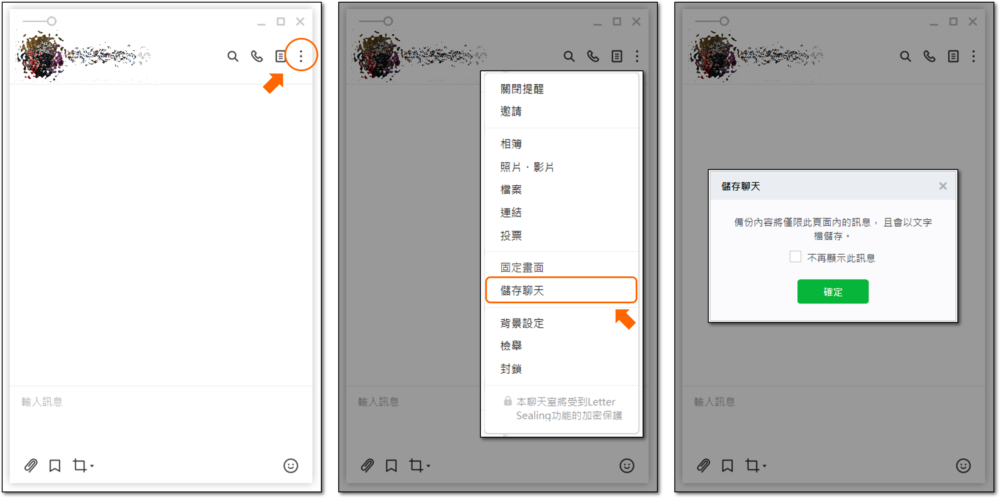
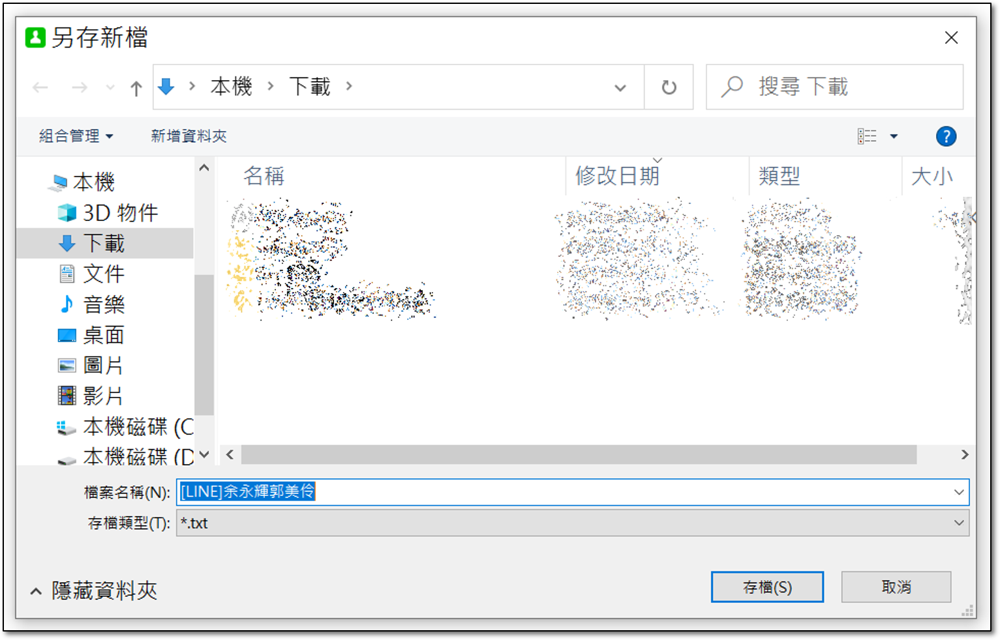
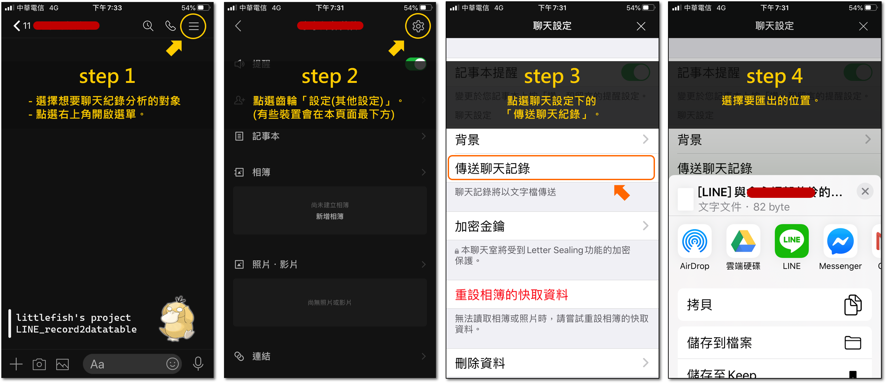

# README

最後更新時間: 2020-11-11

**開發紀錄:**

- 2020-10-01: 建立專案，並拉取之前專案(repo)-Line_chat_analysis的規劃，做重新整理。
- 2020-11-11: 檢查專案，稍微更新部分README.md。

---

## 動機

之前有一些 LINE 的 side project，需要先將對話紀錄，系統性地轉換成表格做儲存，才能做後續分析。加上發現 LINE 現在備分聊天紀錄非常方便!!

所以決定針對這個首要步驟，建立一個專案執行維護並模組化，完善之後可以給其他 silde project 做加值使用。

鎖定要轉換成表格的聊天視窗，可為「一對一、多人、有 chatbot 的群組、聊天群(非真的群組)」等等，基本上 LINE 匯出的格式蠻統一的，所以這些不同的聊天視窗都可適用。  

**附註:**

不可能做到非常客製化，比如情侶對話分析還想要把通話時間長度拉出做一個欄位等等。  
因此本專案只針對最普遍的需求作欄位劃分，後續如果有其他更多的應用，可建立在此基礎上。

---

## 未來期望

- 電腦匯出的格式。包含電腦自動匯出與手動從電腦複製。(因為電腦匯出目前支援畫面有載入的部分，所以先不考慮這功能)
- 改用 python 撰寫
- 分享方式
  - 模組打包成 API 供人使用
  - R 寫成套件
  - Python 寫成模組
- 場景擴充
  - 不止LINE的對話紀錄，比如 messenger, telegram, discord。
  - 系統英文語系的清理。

---

## 如何匯出 LINE 的聊天紀錄

因為 LINE 本身設計的緣故，所以建議要匯出完整的聊天紀錄，請用手機匯出後，再傳入電腦進行本系統操作。  

幾種操作方法的步驟與差異，我在下面羅列出來。  

- 電腦版 LINE，先拉到最上面(這一步一定要，不然只會存到暫時存的)，右鍵全選+複製，或是 Ctrl+A, Ctrl+C，再貼到記事本上，存成 txt。
- 電腦版 LINE，如果不往上拉，直接匯出只會匯出當前有 loading 的紀錄，如果越往上滑，則會有越多的紀錄可以匯出。所以需要全部的對話紀錄，  
- 手機上的 LINE 選擇備分聊天紀錄時，會直接匯出所有紀錄。右上角 hamburger menu > 其他設定 > 聊天設定 > 傳送聊天紀錄。

依照匯出結果來看，會有兩種。因此，本專案會考慮到不同來源，做不同的擷取模組。

1. 「電腦版LINE+手動複製」「電腦版LINE匯出」。
2. 「手機板LINE匯出」。

--

### 電腦匯出對話紀錄方式





step0. 點選想匯出的聊天室  
step1. 點選右上角，開啟選單  
step2. 儲存聊天  
step3. 系統提醒只會儲存有 loading 頁面的內容，且以文字檔儲存。
step4. 選擇要匯出聊天紀錄的位置。

--

### 手機匯出對話紀錄方式



step0. 點選想匯出的聊天室  
step1. 點選右上角，開啟選單  
step2. 點選齒輪「設定」。(有些裝置會在此頁面的最下方)  
step3. 點選傳送聊天紀錄。
step4. 選擇要匯出聊天紀錄的位置。

---

## 資料夾說明

- code/: 放置 Rcode
- data/: 放置範例資料。
  - phone/: 手機匯出的 LINE 聊天紀錄。
  - pc/: 手動複製，或是電腦匯出 LINE 聊天視窗的聊天紀錄。

範例資料明明就同一時段、同一聊天群組，但不知道為何資料大小有差異(127KB, 73KB)，應該是格式問題，所以才會需要依照匯出方式(手機 or 電腦)做不同的模組。

---

## 認識LINE聊天紀錄文字檔

- 照片、影片等，不論未過期和過期，在匯出的文字檔上沒有差異。
- 回復訊息的做法，在匯出的文字檔上不會標註出來。
- 分隔是用一個奇怪的符號，有點類似 tab。  
- <用戶>會使用你個人修改的名稱，但在<訊息>中，雖然手機上看到的，你修改後的用戶名稱，但實際資料匯出時，會是用 LINE 上預設的名稱。

**手機匯出:**

### 手機匯出-開頭資訊

如果是手機轉出的資料，最上面會有基本資訊，可作為最後整理完的存檔資訊。  
比如存檔名稱為「LINE-NCHC_Data_Analysis-YYYYMMDD(from)-YYYYMMDD(to)」。  
以下面的例子，檔案名稱就是「LINE-NCHC_Data_Analysis-20200721-20201001」

```{txt}
[LINE] NCHC Data Analysis的聊天記錄
儲存日期： 2020/10/01 09:32

2020/07/21（二）
```

--

### 手機匯出-聊天

每換新的一天會留下一行空白行。  
接著以日期開頭。

```{txt}
schema: <日期>
格式: YYYY/MM/DD（weekday）
舉例: 2020/07/21（二）
```

聊天紀錄的基本格式如下。

```{txt}
schema: <時間>	<用戶>	<訊息>
格式: 上午/下午HH:MM	littlefish	OKOK~
舉例: 下午05:05	余佑駿（little fish）	好~~
````

收錄一些特殊情況，或是不同的訊息格式。  
"已收回訊息"的動作會沒有分隔符號，且如果是自己收回，LINE會顯示「您已收回訊息」。  

```{txt}
格式: <上午/下午HH:MM>	<LINE名稱已收回訊息>
舉例01: 下午05:05	余佑駿（little fish）已收回訊息

格式: <上午/下午HH:MM>	<您已收回訊息>
舉例02: 下午05:34	您已收回訊息

系統英文語系格式: <上午/下午HH:MM>	<You unsent a message.>
舉例03: 下午01:28	You unsent a message.
```

- 對話紀錄
  - 沒有換行的對話紀錄，不會有""。
  - 有換行的對話紀錄，會被""包起來。
- url
- [貼圖]
- [照片]
  - 多個照片一起傳，也會分成一行一張。
- [影片]
- [檔案]
- [語音訊息]
- [記事本] (記事本內容，空一格之後開始記錄，第一行在這，剩下會在下面。)
- [相簿] (null)
- ☎ 通話時間hh:mm:ss
- ☎ 未接來電
- emoji❤️😘🎉👏😆🤣😂😛🌹😍❤😴🥳👋😭😳🥺☹️😚🥰😱😄

--

### 手機匯出-各種格式的簡單例子

```{txt}
2019/09/29（日）
上午09:06	大正妹	今天天氣真好
上午09:06	可達鴨	"對阿
想要出去玩嗎"
上午09:07	大正妹	好啊 呱呱呱
上午09:07	可達鴨	OKOK~呱呱呱
上午09:10	可達鴨	[貼圖]
上午09:30	可達鴨	☎ 通話時間20:25
上午09:40	大正妹	[語音訊息]
上午09:40	大正妹	☎ 通話時間0:12
上午10:00	可達鴨	☎ 未接來電
上午11:55	大正妹	[照片]
上午11:56	可達鴨	❤️
上午11:58	大正妹	https://github.com/littlefish0331
上午01:52	可達鴨	[檔案]
上午03:31	可達鴨	[相簿] (null)
上午03:31	大正妹已收回訊息
上午03:31	您已收回訊息
上午04:35	大正妹	☎ 通話時間1:04:00
```

--

**電腦匯出:**

格式不盡相同，之後再補

### 電腦匯出-開頭資訊

### 電腦匯出-聊天

---

## 欄位設計

設計最基本的欄位區隔。  

### 聊天視窗名稱-from-to.csv

原始資料為 txt，先轉換成「聊天視窗名稱-from-to.txt」。  

- 聊天視窗名稱-from-to.txt

--

### raw_split_col.csv

再整理成一筆為一次訊息，取名為 raw_split_col.csv，之後的應用都從這裡出發。

PK = iid = all(date + timestamp + user + context)。

- raw_split_col.csv
  - 訊息流水序號 iid(PK)。
  - 日期 timedate: yyyy-mm-dd。
  - 星期幾 weekday: 一、二、...、日。(非必要欄位)
  - 時間 timestamp: hh:mm，24hrs制。
  - 用戶 user: 保持資料原本的使用者名稱。
  - 內文 context
    - 多行訊息要變回一行，並用\n分隔。(是同一個訊息框，但為多行這樣。)
    - 收回訊息也要紀錄，所以要先轉變回正常格式，和<用戶>有特殊符號隔開。
    - emoji: 表情符號的十六進位表示。

--

### raw_daily_summary_系列.csv

從 raw_split_col.csv 的內文 context，統計每日訊息總數。

- raw_daily_summary_user.csv
  - 日期 timedate
  - 星期幾 weekday: 一、二、...、日。(非必要欄位)
  - 用戶 user
  - 訊息數量 context_num

- raw_daily_summary_total.csv
  - 日期 timedate
  - 星期幾 weekday: 一、二、...、日。(非必要欄位)
  - 訊息數量 context_num

--

### context_extract.csv

從 raw_split_col.csv 的內文 context，抓取出新的特徵欄位。

- context_extract.csv
  - 訊息流水序號 iid(PK)。
  - 行數 rows。
  - 有無網址 is_url: 1/0。
  - 是否貼圖 is_sticker: 1/0。
  - 是否照片 is_image: 1/0。
  - 是否影片 is_video: 1/0。
  - 是否檔案 is_file: 1/0。
  - 是否語音 is_voice: 1/0。
  - 是否記事本 is_note: 1/0。
  - 是否建立相簿 is_album: 1/0。
  - 是否視訊 is_video_chat: 1/0。
  - 有無表情符號 is_emoji: 1/0。
  - 是否無接聽(語音或視訊) is_pickup。
  - 通話時間 voice_video_length。

---

## END
